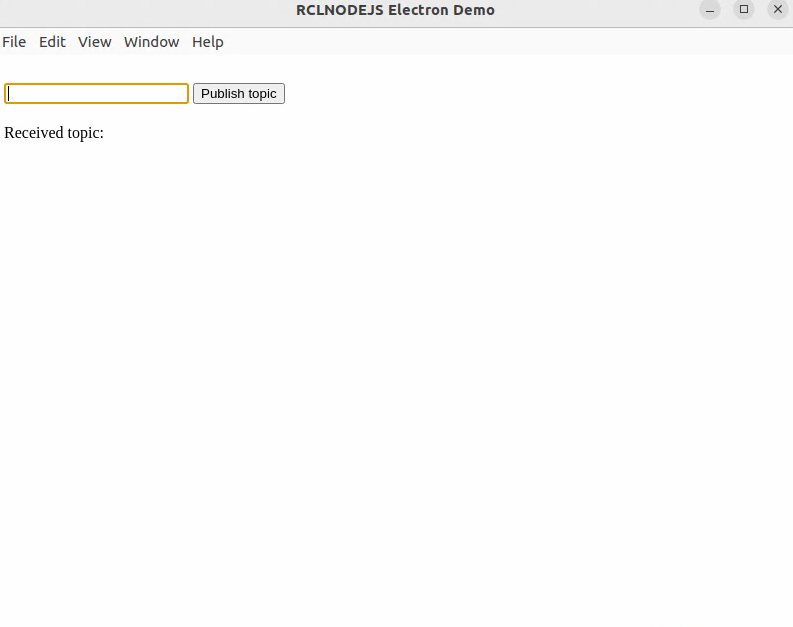

# Rclnodejs Electron demo

## Introduction

This is a minimal rclnodejs demo using Electron. More information about Electron, please check with [Electron documentation](https://electronjs.org/docs/latest/tutorial/quick-start).

The demo includes the following files:

- `package.json` - Points to the app's main file and lists its details and dependencies.
- `main.js` - Introduces the `rclnodejs` native module, starts the app and creates a browser window to render HTML. This is the app's **main process**.
- `index.html` - Includes a text editor where you can input the the topic to be published. This is the app's **renderer process**.
- `renderer.js` - Communicate with main process to publish a topic and get it through a subscription.

## To run the demo

Before starting, please ensure you have installed [nodejs](https://nodejs.org/en).

1. Clone this repository.

```bash
git clone https://github.com/RobotWebTools/rclnodejs.git
```

2. Go into the demo.
```bash
cd rclnodejs/electron_demo
```

3. [SOURCE THE ROS 2 SETUP FILE](https://docs.ros.org/en/jazzy/Tutorials/Beginner-CLI-Tools/Configuring-ROS2-Environment.html#source-the-setup-files)

4. Install dependencies
```bash
npm install
```

5. Rebuild rclnodejs for Electron
```bash
# Every time you run "npm install", run this:
./node_modules/.bin/electron-rebuild
```

6. Run the app
```
npm start
```

If it works, you can see the demo as:


## Resources for Learning Electron

- [electronjs.org/docs](https://electronjs.org/docs) - all of Electron's documentation.
- [Native Node Modules](https://www.electronjs.org/docs/latest/tutorial/using-native-node-modules) - Use a native node module.

